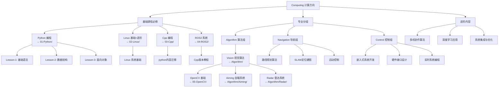

# Computing 计算方向总览

## 适用对象

**控制组**、**导航组**、**算法组**成员共同学习路线

> 2627 学年起，控制（原电控）、导航、算法三个组为平行组，共用 `Computing/` 目录下的公共基础课程（`01`-`04`），分组后各自进入组目录学习专业内容。

## 学习资料

- Python 编程：[点击查看](./01-Python/README.md)
- Linux 基础：[点击查看](./02-Linux/README.md)
- Cpp 编程：[点击查看](./03-Cpp/README.md)
- ROS2 系统：[点击查看](./04-ROS2/README.md)
- 控制组学习路线：[点击查看](./Control/README.md)
- 导航组学习路线：[点击查看](./Navigation/README.md)
- 算法组学习路线：[点击查看](./Algorithm/README.md)

## 学习路径

## 课程安排

### 第一阶段：基础能力建设 (6-7 周)

1. **Python 编程** (国庆 4 天特训) - 编程基础，为后续学习打下基础
2. **Linux 基础** (1 周) - Linux 环境熟悉，开发环境搭建
3. **Cpp 编程** （2 周）- 由 Python 转向 Cpp 编写
4. **ROS2 系统** (2 周) - 机器人框架基础

### 第二阶段：专业分组 (2-3 周)

根据兴趣和战队需求选择：

- **控制组** → 嵌入式、电机与底盘控制
- **导航组** → SLAM、路径规划、运动控制
- **算法组** → 视觉算法（自瞄 / 雷达方向）

### 第三阶段：项目实战 (2-4 周)

- 参与 RoboMaster 机器人项目开发
- 完成最终考核项目

## 培养目标

完成学习路线后，你将具备：

- 熟练的 Python 编程能力
- Linux 开发环境使用能力
- ROS2 机器人框架应用能力
- 专业方向的核心技能
- RoboMaster 比赛开发经验
