# Mechanic 机械方向

## 适用对象

**机械方向**成员学习路线（2627 学年起，课程内容与学习路线合并放在本目录下）

## 学习路径

```mermaid
graph TD
    A[Mechanic 机械方向] --> B[基础课程必修]
    A --> C[专业深化]
    A --> D[RoboMaster专项]
    A --> E[进阶应用]

    B --> F[机械设计基础<br/>→ 本目录课程内容]

    F --> F1[Inventor 3D建模]
    F --> F2[草图绘制与约束]
    F --> F3[零件建模技术]
    F --> F4[装配设计方法]
    F --> F5[工程图绘制]

    C --> G[基础力学]
    C --> H[基础结构]

    G --> G1[静力学基础]
    G --> G2[动力学基础]
    G --> G3[材料力学]

    G1 --> G11[力系平衡]
    G1 --> G12[桁架分析]
    G1 --> G13[梁的弯曲]

    G2 --> G21[质点动力学]
    G2 --> G22[刚体运动]
    G2 --> G23[振动分析]

    G3 --> G31[应力应变分析]
    G3 --> G32[强度计算]
    G3 --> G33[疲劳设计]

    H --> H1[轴系设计]
    H --> H2[传动系统]
    H --> H3[材料选择]
    H --> H4[加工工艺]

    H1 --> H11[轴的设计计算]
    H1 --> H12[轴承选择]
    H1 --> H13[联轴器设计]

    H2 --> H21[齿轮传动]
    H2 --> H22[带传动]
    H2 --> H23[链传动]

    H3 --> H31[金属材料]
    H3 --> H32[非金属材料]
    H3 --> H33[复合材料]

    H4 --> H41[机械加工]
    H4 --> H42[3D打印]
    H4 --> H43[表面处理]

    D --> I[舵轮移动系统]
    D --> J[机械臂设计]
    D --> K[整车集成]

    I --> I1[底盘结构设计]
    I --> I2[动力传动设计]
    I --> I3[悬挂系统设计]

    J --> J1[六自由度结构]
    J --> J2[关节设计]
    J --> J3[末端执行器]

    K --> K1[模块化设计]
    K --> K2[装配工艺]
    K --> K3[维护性设计]

    E --> L1[有限元分析FEA]
    E --> L2[结构优化设计]
    E --> L3[轻量化技术]
    E --> L4[智能制造技术]

    style A fill:#e1f5fe
    style B fill:#f3e5f5
    style C fill:#e8f5e8
    style D fill:#fff3e0
    style E fill:#fce4ec
```

## 学习顺序建议

### 第一阶段：软件基础 (2-3 周)

- **Inventor 入门** - 3D 建模软件操作
- **工程图绘制** - 技术图纸制作

### 第二阶段：理论基础 (4-5 周)

- **基础力学** (2-3 周) - 静力学、动力学、材料力学
- **基础结构** (2-3 周) - 轴系、传动、材料与工艺

### 第三阶段：项目实践 (3-4 周)

- **RoboMaster 专项设计** - 舵轮底盘、机械臂设计
- **最终设计项目** - 完整机器人系统设计

## 培养目标

完成学习路线后，你将具备：

- 熟练使用 Inventor 进行 3D 建模设计
- 理解机械设计中的力学原理
- 掌握机器人常用机械结构设计
- 具备独立设计机器人机械系统的能力
- 掌握有限元分析和结构优化方法

## 最终考核项目

设计一个完整的简易机器人，包含：

- **舵轮移动系统**（含被动轮设计）
- **六自由度机械臂**
- **完整的工程图和设计说明书**

---

## 课程内容

这份培训课程专为 ROBOMASTER 战队新生设计，旨在系统地建立机械工程知识体系，从基础理论到实践应用，助你快速成长为一名合格的机器人工程师。

### 一、入门课程：Inventor入门

本课程是所有机械组新生的必修课。它将带你快速熟悉3D建模软件 Autodesk Inventor，掌握基础建模、装配、工程图绘制等核心功能，为你后续的设计工作打下坚实的基础。

#### 具体内容与说明

- 课程目标：掌握 Inventor 基础操作，能够独立完成简单的零件和装配体建模。
- 核心内容：
   - 草图绘制：学习基本草图工具、尺寸标注和约束。
   - 零件建模：掌握拉伸、旋转、扫掠、放样等常用建模方法。
   - 装配体设计：学习如何利用约束将多个零件组装在一起，并进行运动仿真。
   - 工程图绘制：将三维模型转化为标准的二维工程图，包括视图创建、尺寸标注和技术要求。
- 培训方式：线下授课与实践操作相结合，配合指定练习项目。

### 二、基础课程：核心知识体系

本课程分为“基础力学入门”和“基础结构入门”两大模块，旨在为你补全机器人设计所需的核心理论知识。

#### 1. 基础力学入门

本模块将带你理解力学原理在机器人设计中的应用，为结构优化和轻量化设计提供理论支撑。

- 平面桁架：理解桁架结构的基本原理，掌握其在机器人底盘和支撑结构中的应用。
- 弯曲梁：学习梁在受力时的弯曲变形和应力分布，为设计受力部件提供依据。
- 应力应变：理解材料在受力后的内部变化，为材料选择和强度校核打下基础。
- 轴向拉压力：分析构件在拉伸和压缩载荷下的表现，为设计连杆和支撑件提供指导。
- 扭转：学习轴类零件在扭矩作用下的变形和应力，对电机轴、传动轴的设计至关重要。
- 轻量化设计：学习在保证结构强度的前提下，如何通过拓扑优化和结构设计来减轻机器人重量。
- 质点动力学与刚体运动：理解机器人的运动规律，为控制系统的设计提供运动学和动力学模型。
- 惯性与旋转：分析旋转部件（如轮子、电机）的惯性特性，掌握如何通过配重和结构优化来提高机器人的动态稳定性。
- 动态响应与阻尼（一）：理解振动产生的原理，学习如何通过结构设计来减少不必要的振动。
- 动态响应与阻尼（二）：学习阻尼在抑制振动中的作用，并掌握减震结构的设计方法。

#### 2. 基础结构入门

本模块将系统介绍机器人设计中常用的机械结构和零部件，并深入探讨其设计原则和加工工艺。

- 轴：学习轴的设计、选材和加工，了解不同类型的轴（如传动轴、支撑轴）及其应用。
- 轴承与轴系：理解轴承的类型、工作原理和选择方法，并学习如何设计稳定可靠的轴系结构。
- 螺丝，螺母，电机与标准件：掌握常用标准件的规格、用途和装配方法，并了解不同类型电机的特性和选型。
- 传动系统（齿轮传动，带传动与丝杠）：系统学习三种常用传动方式的优缺点、设计要点和应用场景。
- 误差与加工：理解机械加工中的尺寸误差和形位误差，并学习如何通过设计来补偿和控制这些误差。
- 平面连杆：学习连杆机构的设计原理，并分析其在机器人运动机构中的应用。
- 材料：介绍机器人设计中常用的金属、塑料和复合材料，并指导如何根据性能要求进行材料选择。
- 加工工艺：了解常见的机械加工工艺（如车、铣、钻、3D打印、激光切割），并学习如何根据设计要求选择合适的加工方式。
- 设计原理：总结并归纳机器人设计的基本原则，如模块化设计、DFM（可制造性设计）和DFA（可装配性设计）。
- FEA (有限元分析)：学习有限元分析的基本原理，并掌握如何利用Inventor等软件对机器人结构进行应力、应变和振动分析，从而进行结构优化。

#### 最终考核：独立设计一款简易机器人

独立设计一款简易机器人，要求具有一套可靠的舵轮系统，搭配两个被动轮，装载一个可以搬运物品的简易机械臂，要求机械臂可以进行六自由度作业

#### 软件工具（包括进阶内容）

Autodesk Inventor（主要建模工具，必备）

Autodesk CAD（2D图纸修改工具，必备，但是不需要精通）

Autodesk Fusion（辅助工具，必备，但是不需要精通）

MATLAB(进阶必备工具，主要用途为simulink调参)

Adams（进阶工具，主要用途为多体动力学仿真）

Ansys/COMSOL（进阶工具，主要用途为有限元仿真）

#### 在线资源

Inventor入门：

[inventor2021入门详解(每个功能会有一个短视频)(174集 已完结)_哔哩哔哩_bilibili](https://www.bilibili.com/video/BV1744y1m7TG/?spm_id_from=333.337.search-card.all.click&vd_source=9b54dcd03c47f00a87a6ee2cd9486378)

CAD入门：

[【全CAD教学合集】零基础教学、绘图手法提升、制图知识讲解_哔哩哔哩_bilibili](https://www.bilibili.com/video/BV1aT4y1B7oY/?spm_id_from=333.337.search-card.all.click&vd_source=9b54dcd03c47f00a87a6ee2cd9486378)

Fusion：

[2023年最新 Fusion 360 教程（持续更新中）_哔哩哔哩_bilibili](https://www.bilibili.com/video/BV1xX4y1E7nG/?spm_id_from=333.337.search-card.all.click)

Simulink：

[0基础直接带你上手matlab simulink仿真（不是标题党，讲解超级细致用心）（非线性系统自适应控制器的搭建）_哔哩哔哩_bilibili](https://www.bilibili.com/video/BV1cF411j7Ho/?spm_id_from=333.337.search-card.all.click&vd_source=9b54dcd03c47f00a87a6ee2cd9486378)

Adams：

[【ADAMS从入门到精通（基础篇）】快速上手Adams，全面讲解_哔哩哔哩_bilibili](https://www.bilibili.com/video/BV1Xg4y1z7uX/?spm_id_from=333.337.search-card.all.click&vd_source=9b54dcd03c47f00a87a6ee2cd9486378)

其他战队培训视频：

（素材来自哈工大竞技机器人队与HUSTROBOCON机器人队

，推荐哈工大的机架设计至轴系设计部分，华科都可以看）：

[【机械组竞培营】机架设计_哔哩哔哩_bilibili](https://www.bilibili.com/video/BV16r4y1j7BS?spm_id_from=333.788.videopod.sections&vd_source=9b54dcd03c47f00a87a6ee2cd9486378)

[HUSTROBOCON机器人队2025赛季培训——机械组培训第一讲（暨校机器人大赛机械组培训）_哔哩哔哩_bilibili](https://www.bilibili.com/video/BV1Sb28YtED3?spm_id_from=333.788.videopod.sections&vd_source=9b54dcd03c47f00a87a6ee2cd9486378)
