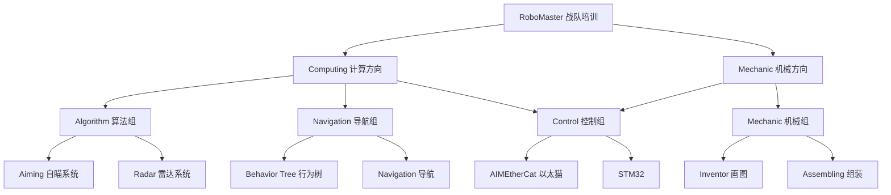

# AIM Robotics 战队新成员培训课程（2026-2027 学年）

> 本仓库是 UNNC AIM 战队 **2627 学年**的新生培训课程仓库。跨学年的仓库总览与整体使用指南可移步 [aim-rookie-courses](https://github.com/unnc-aim/aim-rookie-courses)。

## 课程概述

本培训体系专为 AIM Robotics 战队新成员设计，涵盖**计算**和**机械**两大专业方向。计算方向下设**控制、导航、算法**三个平行组，无论你选择哪个方向，都将获得扎实的理论基础和丰富的实践经验。

## 2627 学年新变化

相比上一学年（[aim-2526-rookie-courses](https://github.com/unnc-aim/aim-2526-rookie-courses)，已归档），本学年仓库布局做了如下调整：

1. **仓库按学年拆分**：无年份的 `aim-rookie-courses` 只保留仓库总览与整体使用指南；各学年课程放入独立的 `aim-<学年>-rookie-courses` 仓库，学年结束后归档。
2. **路线与内容合并**：取消 `Contents/`（课程内容）与 `Routes/`（学习路线）分离架构，学习路线与课程内容统一放在各方向 / 组的目录下，组目录的 `README.md` 即该组入口。
3. **三个平行组**：控制、导航、算法三个组彼此平行，同属 `Computing/` 目录：
   - **电控组更名为控制组**（Electronic → Control），学习路线与培养目标不变；
   - **导航从算法组独立**，成为与算法平行的组；
   - **算法组聚焦视觉方向**（自瞄 / 雷达），原 Vision 学习路线并入算法组。
4. **课程全局编号**：公共基础课 `01`-`04` 为计算方向全组必修，其后课程按开课顺序全局连续编号（如算法组首门课程 `05-OpenCV`）。

课程内容本身也将有小幅调整，我们会逐步更新。更新历史/日志可见 <https://github.com/unnc-aim/aim-2627-rookie-courses/commits/main/>

### 目录结构

```bash
aim-2627-rookie-courses/
├── Computing/                  # 计算方向（控制 / 导航 / 算法三组共同入口）
│   ├── 01-Python/              # 公共基础：Python 编程基础（3 节课）
│   ├── 02-Linux/               # 公共基础：Linux 系统基础（2 个 Section）
│   ├── 03-Cpp/                 # 公共基础：Cpp 编程基础
│   ├── 04-ROS2/                # 公共基础：机器人操作系统 ROS2
│   ├── Control/                # 控制组（原电控组）
│   ├── Navigation/             # 导航组（2627 起独立成组）
│   └── Algorithm/              # 算法组（视觉方向）
│       ├── 05-OpenCV/          # 算法组首门课程：计算机视觉
│       ├── Aiming/             # 自瞄系统学习路线
│       └── Radar/              # 雷达系统学习路线
├── Mechanic/                   # 机械方向（课程与学习路线）
├── ENV_SETUP.md                # 环境配置 / 快速开始
└── README.md
```

### 学习路线分支图



### 使用流程

1. **确定专业方向** → 计算方向进入 [`Computing/`](./Computing/README.md)，机械方向进入 [`Mechanic/`](./Mechanic/README.md) 查看学习路线
2. **公共基础学习** → 计算方向按 `01-Python → 02-Linux → 03-Cpp → 04-ROS2` 顺序完成基础课程
3. **专业深化** → 进入所属组（控制 / 导航 / 算法）的路线与课程，或在基础课程完成后进入机械方向的专业内容

## 专业方向选择

### 计算方向（控制 / 导航 / 算法）

适合对编程、算法、电路设计感兴趣的同学

**核心技能**：Linux 系统管理、Python 编程、Cpp 编程、计算机视觉、嵌入式开发

**就业方向**：软件工程师、算法工程师、嵌入式工程师、系统架构师

| 组别 | 职责 | 典型产出 | 主技术栈 |
| --- | --- | --- | --- |
| 控制 | 让机构精确执行动作：电机、底盘、云台、发射机构 | 控制器固件 | C++、STM32、EtherCAT、RTOS |
| 导航 | 让机器人知道在哪、要去哪、怎么走 | 导航栈与行为决策 | ROS2、SLAM、规划算法 |
| 算法 | **除了导航和控制之外的全部**：视觉（自瞄 / 雷达）、裁判系统协议、数据工具、整车集成 | 感知 / 协议库 / 工具链 / 主 workspace | C++、Python、OpenCV、ROS2 |

#### 各组典型仓库（往届项目）

> 仓库前缀是赛季 / 比赛代号（如 `26RC` = 2026 RoboCon 赛季），完整命名规则见 [战队规范](https://github.com/unnc-aim/.github)。

##### 控制组

- [suction_control](https://github.com/unnc-aim/suction_control) - 吸盘机构控制
- [26RC_R1_controller](https://github.com/unnc-aim/26RC_R1_controller) - 26RC R1 机器人主控制器
- [universal_controller](https://github.com/unnc-aim/universal_controller) - 通用控制器接口架构（第一版）

##### 导航组

- [27UL_Sentry_behavior](https://github.com/unnc-aim/27UL_Sentry_behavior) - 哨兵机器人行为决策
- [26UL_pb2025_sentry_nav](https://github.com/unnc-aim/26UL_pb2025_sentry_nav) - 哨兵导航 Sim2Real 方案（PolarBear 战队 RoboMaster 2025 开源包，导航组参考实现）

##### 算法组

- [26UL_sp_vision_25_rosy](https://github.com/unnc-aim/26UL_sp_vision_25_rosy) - 魔改同济自瞄视觉（ROS 兼容上车版）
- [26RC_R2_kfs_tracker](https://github.com/unnc-aim/26RC_R2_kfs_tracker) - RoboCon KFS 方块目标跟踪
- [26RC_R2_spear_head_tracker](https://github.com/unnc-aim/26RC_R2_spear_head_tracker) - RoboCon 2026 矛头目标跟踪
- [26UL_dji_referee_protocol](https://github.com/unnc-aim/26UL_dji_referee_protocol) - DJI 裁判系统协议解析
- [27UL_Sentry_ws](https://github.com/unnc-aim/27UL_Sentry_ws) - 哨兵整车主 workspace：中等复杂度机器人的主 workspace 由算法组负责组织，部分 submodule 暂未公开，可参考其组织结构
- [aim-feishu-rm-assistant](https://github.com/unnc-aim/aim-feishu-rm-assistant) - 飞书 RM 助手（Go）
- [rm-search](https://github.com/unnc-aim/rm-search) - RM 资料搜索引擎（Go）
- [RoboMark](https://github.com/unnc-aim/RoboMark) - 数据集标注平台（Vue）

#### 学习路线

- [查看计算方向总览](./Computing/README.md)
- [查看控制组学习路线](./Computing/Control/README.md)
- [查看导航组学习路线](./Computing/Navigation/README.md)
- [查看算法组学习路线](./Computing/Algorithm/README.md)

### 机械方向

适合对机械设计、结构分析、制造工艺感兴趣的同学

**核心技能**：3D 建模、力学分析、机械结构设计、制造工艺

**就业方向**：机械设计工程师、结构工程师、制造工程师、产品经理

[查看机械学习路线](./Mechanic/README.md)

## 课程模块概览

### 公共基础模块（计算方向所有组共同学习）

- **Python 编程**：编程基础语法、数据结构、面向对象编程
- **Cpp 编程**：Python 知识迁移
- **Linux 基础**：Linux 系统操作、命令行工具、开发环境配置
- **ROS2 系统**：机器人操作系统基础

### 专业方向模块

#### 计算方向

- **控制**：通信协议（EtherCAT）、电机控制、嵌入式开发
- **导航**：SLAM 定位建图、路径规划、运动控制
- **算法**：OpenCV 视觉基础、自瞄系统、雷达系统

#### 机械方向

- **机械设计**：3D 建模、力学分析、结构设计

## 培养目标

### 计算方向毕业生能力

- 熟练使用 Linux 进行开发工作
- 编写 Python & Cpp 程序解决实际问题
- 使用 OpenCV 进行基础图像处理
- 借助 AI 工具提升开发效率
- 具备 RoboMaster 机器人算法开发能力

### 机械方向毕业生能力

- 熟练使用 Inventor 进行 3D 建模设计
- 理解机械设计中的力学原理
- 掌握机器人常用机械结构设计
- 具备独立设计机器人机械系统的能力
- 掌握有限元分析和结构优化方法

## 学习环境

### 软件工具

**计算方向**：Git、VS Code、虚拟机（VirtualBox / Ubuntu 24.04 LTS）、Python、Cpp、OpenCV、ROS2 Jazzy、Linux 工具链

**机械**：Autodesk Inventor

### 硬件要求

- 系统：计算方向 Windows 或 macOS 皆可，机械组需要 Windows
- 内存：8GB+ （推荐 16GB+）
- 硬盘：50GB+可用空间
- 处理器：计算方向如是 Windows 需要支持虚拟化的 64 位 CPU
- 网络：稳定的互联网连接，如果不在学校网络环境下需要代理

## 学习资源

### 在线资源

- [CS 自学指南](https://csdiy.wiki/) - 计算机科学学习路径
- [RoboMaster 官方技术论坛](https://www.robomaster.com/) - 比赛技术交流
- [Autodesk 教育版](https://www.autodesk.com/education/) - 免费软件下载

## 本地环境配置指南 / 快速开始

- 请移步 [ENV_SETUP.md](./ENV_SETUP.md)

## 维护人员名单

- [Robert He](https://github.com/hnrobert)
- [Xiaoyan Gong](https://github.com/Calc1te)
- [Animex77](https://github.com/Animex77)
- [lv_xin](https://github.com/lvxin1024)
- [HappyDog](https://github.com/HappyDog060713)
- [AnthonyBvvd](https://github.com/AnthonyBvvd)

祝食用愉快！
